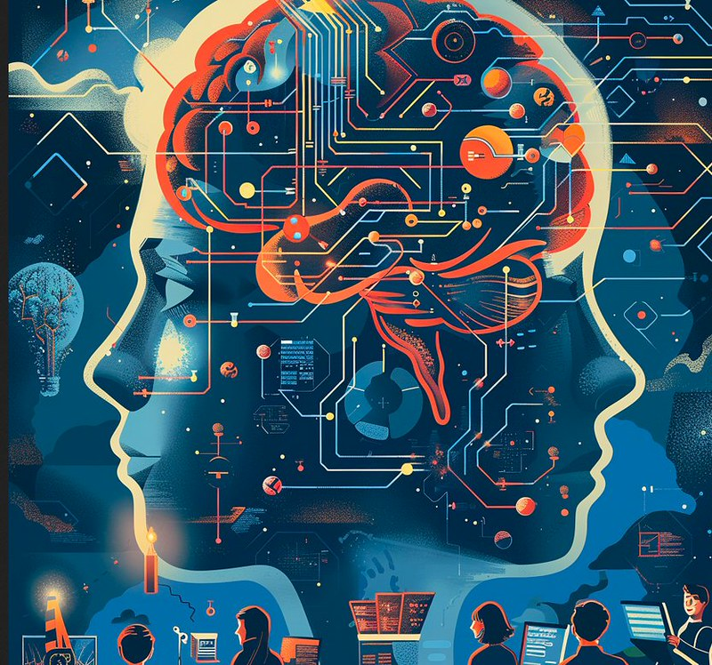

# AI technology 

In the last couple of years, AI has improved immensely. This has had an especially large impact on education. AI is now capable of providing accurate answers to most class problems. This can make it easier to study and check answers, however, it’s also easy to overuse this technology. AI doesn’t necessarily mean the user is learning, in fact, oftentimes it means the opposite. Since AI can trivialize certain tasks, it’s often been used to bypass any learning requirement from the user's end. This remains the case for computer science as well. In order to analyze and reflect on my experience with AI, I’ll be going over some of the AI engines that exist and my experience using them. 
There are many AI algorithms that one could use. ChatGPT, Gemini AI, and DeepSeek are all powerful AI engines with an active user base. These engines are also capable of analyzing code and making suggestions for changes. I've also used most of these languages to help with my code. However, these engines aren’t always the most accurate for programming. For computer science, CoPilot is often seen as one of if not the most powerful AI tool. This is because it’s both specialized for programming and can work as an extension for many coding programs. I’ve certainly used this engine a lot to improve my code. But, to fully reflect my usage of AI, I’ll analyze each section of my Computer Science class and gauge what my AI usage has looked like. This will hopefully provide insight into my relationship with this technology.

# Class Experiences

## Experience WODs e.g. E18

- For WOD assignments outside of class, it’s oftentimes easiest to not use AI. Since most WODs have a corresponding video detailing what to do, it’s better to simply follow along with the video rather than doing something with AI which could be less accurate. This also allowed me to learn in real time which functions were doing what. That kind of information isn’t always accessible when using AI.
 
## In-class Practice WODs
- For the in class practice WODs, I’ll oftentimes both use and avoid AI. Many times the practice WODs will go over previous exercises, and in those instances I find it most useful to look at my previous projects and use the code I’ve already learned. However, if I ever encounter any new issues, I’ll often use CoPilot to help me fix them. 

## In-class WODs

- I’ve utilized a lot of AI during the In-class WODs. Since many assignments like copying a website involve tedious and lengthy tasks, it can be much more efficient to use AI to speed up the process. There are also implementations to things that I might not fully understand. In those instances, AI is often the most effective tool. I’ve used chatGPT to make a lot of base code, and I’ve used coPilot to fix and implement specific things during these assignments. However, since I’m not always aware of what the AI code is doing, I’ve sometimes found it difficult to implement my own code when working. 

## Essays
- I’ve used AI for some of my essays. I personally find it easier to write most of my essays, but it definitely can be tedious to write things that don’t require much thought. In those instances, I’ve used chatGPT to help speed up my writing. I’ve also used chatGPT when my writing feels awkward and I want some form of improvement. For the most part however, I like to write by myself. 

## Final project
- My final project has involved the use of all tools at my disposal, and AI is certainly no exception. AI has been very useful in both implementing functions that I’m unfamiliar with as well as providing feedback as to how things work. However, in order to make sure I understand what's going on, before I use AI I’ll often watch videos and look up what people are doing to program certain functions. Then, I often use CoPilot to fix my code when necessary or add functions that I can understand. Doing things this way has allowed me to both learn and keep up with new implementations. 

## Learning a concept / tutorial
- When learning new concepts, I’ll use AI only on occasion. It’s often easier to follow a video or a webpage about the topic. AI’s like chatGPT can help in edge cases like if I have specific questions. 

## Answering a question in class or in Discord
- For all actions that involve social interaction I won’t use AI. I think it’s way quicker and easier to answer things yourself, and It’s hard to 

## Asking or answering a smart-question
- Since smart questions and answers involve a very personal understanding, I find it easiest to not use AI. I think it’s better to simply reflect on things that an individual struggles with and form answers most accurate to someone's personal experience. 

## Coding example e.g. “give an example of using Underscore .pluck”
- I’ve occasionally used AI’s like chatGPT to provide small examples. Mostly things like text over images, or different implementations for navbars. Small things like these have helped me improve and further the possibilities of my code. 

## Explaining code
- I’ve rarely used AI to examine code. Most of the time I’ll keep looking at the code to figure out what’s happening. Usually with time I can gauge what's going on. Only when I’m under time pressure or lack certain knowledge will I use CoPilot to explain what's going on. 

## Writing code
- In contrast to explaining code, I use AI a lot to write code. Sometimes it’s quicker to implement functions using CoPilot. Things like a repetitive set of input texts can be easily written through AI. AI can also be useful to help implement new things. For instance, implementing text on images was something I found to be quite difficult. However, by asking for help through chatGTP I was able to fully implement the task. 

## Documenting code
- I don’t think I’ve ever used AI to document code. In most cases it’s easiest to document things through personal annotations. I think I’d find it more difficult to keep track of AI documentations. 

## Quality assurance 
- Quality assurance has been very difficult for me, which is why I’ve often relied on AI. It’s important to read and check which parts of the code are errors, but it's really difficult sometimes to gauge what aspects are missing. Sometimes some other file in a completely different directory will be the source of all the errors. This is often hard to spot but it’s easier with CoPilot. But, sometimes AI will misunderstand or give an incorrect answer to an issue. In such cases I’ll also often check Stack Overflow and other chat rooms for any documentation. 

## Overall
- Overall, I've used a lot of AI to help with this class. I've mostly utilized chatGPT and Copilot to help me fix, improve, and write code.

# Outside of class. 
Outside of the scope of my class work, AI has many ramifications on other projects as well as learning. In order to explore how to effectively utilize AI, it's also important to look at the field as a whole and what concepts AI is good and not good at. 

## III. Impact on Learning and Understanding:
I think AI has both aided and hindered my learning. I’ve used AI to gain insight and learn new functions, especially with things like the Vercel database. However, I’ve also tried to try and speed through certain exercises like in the Wods. In those instances, I may have become too over-reliant on the AI to give accurate answers. There were some Wod’s where I felt that had I just written it myself, I might’ve completed the assignment. AI could also be used to skip learning. Sometimes instead of implementing a challenging function, I’ll ask an AI to do it for me. This can be helpful in the short term, but it doesn’t mean I’m learning programming. I think moving forward it’s important to recognize where I can use AI. I think it can be great for speeding up functions I already know but avoided for things that require new learning. 

## IV. Practical Applications:
There are already major examples of AI being used in our class. Things like CoPilot have been extremely helpful in implementing code. However, even outside of the class purview, there’s a lot more ways in which AI can be used. My interest is game programming, and I can see that AI can be used in both coding and game functions. Engines like Unity might gain their own AI assist programs that could similarly speed up coding. Also, games like rain world already use dynamic AI that make enemies move naturally and adapt to player movement.  

## V. Challenges and Opportunities:
I’ve already mentioned how AI didn’t always provide what I wanted from an assignment. This is a very real limiting factor of AI, many times the AI won’t understand how a certain function could be implemented. That’s because implementation also requires a big picture understanding of all the files in the code, as well as the purpose behind the implementation. This is very often the case in debugging. There could be an error that technically could be solved by removing or implementing a function, but that same function might also be necessary for the program to work as intended. Even when telling the AI the context, it doesn’t always find the right answer. For further integration, I think it’s important to provide resources and examples for how to implement certain things. When people encounter errors, they can ask AI for help. 

## VI. Comparative Analysis:
Traditional learning methods like Lectures and Textbooks provide knowledge by simply telling the person information. AI can often do the same, but it might not always provide the full picture of the problem. The person might ask how to do something, but the AI might give an answer that requires even more knowledge. Since lectures and classes go from section to section, they provide a timeline foundation of what to learn. Where AI really shines is its ability to engage and reinforce learning by interacting with it. AI can help answer questions as well as provide examples to certain things. This provides a distinct and useful form of learning that traditional methods don’t have. 

## VII. Future Considerations:
I think that AI is a useful tool that can be helpful, but just as easily unproductive. AI is at its best when it helps someone learn new things or speed up work. It’s not great when it’s used to solve every problem. I think people should be taught how to implement functions normally and quizzed on those topics so that they maintain an understanding of code functionality. I can program many things without AI since I understand how certain parts of code work. But, I have also used AI to code things that I don’t understand and they break when I try to use them. It’s important to make people not overuse AI, and forcing them to at least initially implement code on their own can be a massive help.

## VIII. Conclusion:
Reflecting on my experience with AI in this software engineering course, I recognize its dual role as both a powerful aid and a potential crutch. Tools like GitHub Copilot and ChatGPT have aided me when doing repetitive tasks, debugging code, and providing quick fixes. This is particularly true for time-sensitive assignments like WODs and the final project. However, overreliance on AI occasionally hindered my learning, as sometimes I accepted whatever an AI gave me without engaging with it. Moving forward, I hope that more traditional methods of learning are first applied so that a person can experience and fully understand their coding. I hope they are then given the freedom to use AI to aid their work. AI is great for reinforcement, but a truly competent programmer won’t become reliant on it. 
