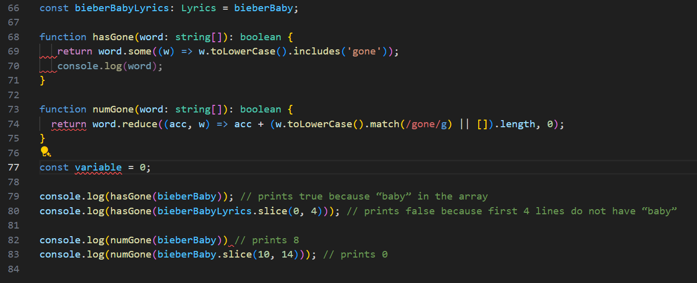

 It’s one thing to write code that’s functional, but it’s another thing entirely to make code that’s  
functional and readable. 

 When I work alone, my code will often turn into a big mess of complicated jargon. This happens for two main reasons. For one, it’s difficult to keep a level of consistency with every function, variable, algorithm, statement, or other aspect of the code. Human errors are inevitable in any coding project. I also have problems with coding for the short term. Sometimes I’ll focus on getting a piece of code to work even if it looks ugly. This can lead to problems down the line as discerning what a function is supposed to do can get hard to tell. Writing code neatly is an important and complementary skill in functional programming. It makes projects more readable and easier to work with. Thus, for the long term health of any project, it’s always good to write neat code. 

 When working in VSCode, I was able to use the ESLint extension for the first time. ESLint acts to standardize code into a consistent and readable format. Anytime code is written in a way that doesn’t align with the ESLint formatting, the plugin will mark the section as an error and comment on the type of error made. 

 In terms of making code organized, this plugin works wonders. It’s consistent, catching errors that easily go unnoticed. It’s also easy to use and it always tells the user where the errors are. However, getting used to the plugin takes some time. It can be annoying to fix some of the errors the plugin marks. The feedback isn’t always super intelligible, and the errors could be something minor. For example, an error could be a misplaced space somewhere on a line, and that space might not be super noticeable. Sometimes, I might also mistake an error for a different kind of error. Thankfully, the engine is also capable of fixing most errors automatically. Clicking the highlighted error area will provide options to standardize the text. It’s not capable of fixing everything, so it can still pose a challenge to figure out the error. But, overall the plugin is very helpful.

 In the above screenshot, there’s some pieces of code that are underlined red. These areas don’t align with the ESLint standard and should be adjusted. Sometimes this is easy, but some of the errors might be difficult to notice or change. 

 Ultimately, the utility of ESLint will pay dividends. Working with messy code can be an infuriating experience. Especially if it’s a project that I haven’t worked on in a while or it’s someone else's code. Having a tool like ESLint helps prevent coding from becoming awkward and annoying. I hope to use this plugin to make future projects better. 
