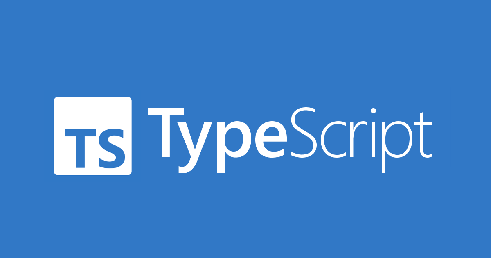

I have never used Typescript in all my programming experience. But, so far Typescript seems to be an intuitive userfriendly programming language. When using the language, I felt it was most similar to JavaScript. This tracks as I would learn that Typescript is a syntatic superset of JavaScript. 

While very similar to JavaScript, there are many important differences between JavaScript and Typescript. Most notably, the syntax and compatibility of both languages work a bit differently. Typescript is statically typed while JavaScript is dynamically typed. This means that variables in Typescript must be declared when they’re created, but in JavaScript, the variable doesn’t have to be declared. Another major difference that I’ve yet to fully experience with is that Typescript can compile into JavaScript. This effectively allows the user to develop a program in both languages which can speed up a lot of the programming process. I have yet to use this utility of Typescript, but I feel like this makes the language quite effective from a software engineering standpoint. Programming in Typescript is also programming in JavaScript, and with the support tools provided to the Typescript language, it can improve the overall code quality of a project.  

