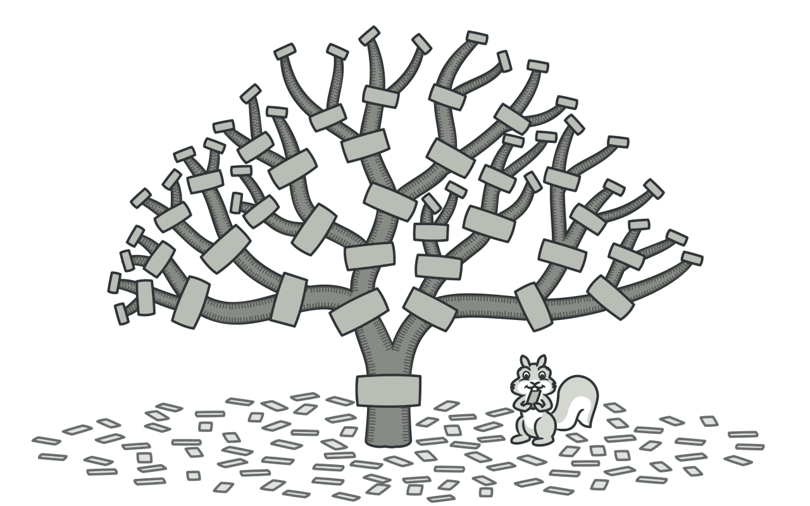
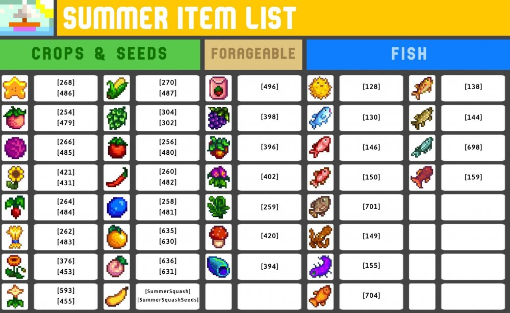

Designing Good Solutions

In programming, there’s a concept called “Design Patterns.” This term refers to repeatable, general solutions to common problems that arise in software development. For example, when building a user interface, a developer might use the "Model-View-Controller" (MVC) pattern to separate data logic from the user interface. This approach helps make code more organized, easier to maintain, and scalable.

This seems like a simple idea, but I haven’t had much experience with this concept. Most of my coding currently comes from classwork, and homework assignments usually focus on learning new ideas through small, isolated projects. Because of this, it’s difficult to formulate or identify a recurring design pattern. However, it’s not impossible. While most classwork centers around exploring new concepts, it’s still important to code quickly and efficiently, especially during in-class WOD (Workout of the Day) assignments. These timed exercises require students to work in a focused and structured way.
To complete these WODs, I often rely on a light version of a design pattern strategy. For instance, some of the WODs involved learning Next.js and replicating an existing website. Problems like these tend to follow a similar pattern of actions. Most websites include standard components such as a navbar, a central image, an information section, and sometimes a unique element like a button with an image overlay. Given these similarities, I usually prepare for these assignments by mapping out the required steps for each part. Components like the navbar follow a predictable workflow: first, import similar code from a previous project, then update the text and color scheme, and finally add images if needed. Nearly every part of the website can be broken down into a flowchart-like decision process, and using this informal design pattern approach has made my coding more efficient.

I’ve also applied some aspects of design pattern thinking for my personal game projects. Oftentimes there’s a recurring structure when adding certain game mechanics. When making an interactive game with a lot of objects, many items will share common properties and labels. For instance, There could be two food items which can interact with player health variables, while there’s many weapon items that deal damage. It would be very time consuming and complicated to program these items individually, however, by using a design pattern these could be more easily implemented. There could be a main dataset that stores all the variables that make an item distinct. It stores the type of item, the stats of an item, its display images, and so on. By doing this, implementing new items can be as simple as creating a new dataset entry. 

The above image shows how game items could use distinct labeling. For game that the image is based on, this labelling effects the mechanics of each item as well as their economic value.

Ultimately, while I don’t feel very experienced with formal design patterns, I’ve already been using similar strategies to streamline my programming. These patterns help me approach class assignments and game design with a clearer path and a more organized mindset. Programming often involves solving similar problems again and again, so creating structured processes to handle those problems is a valuable skill. I hope to continue improving these skills to become a more effective and confident programmer.

