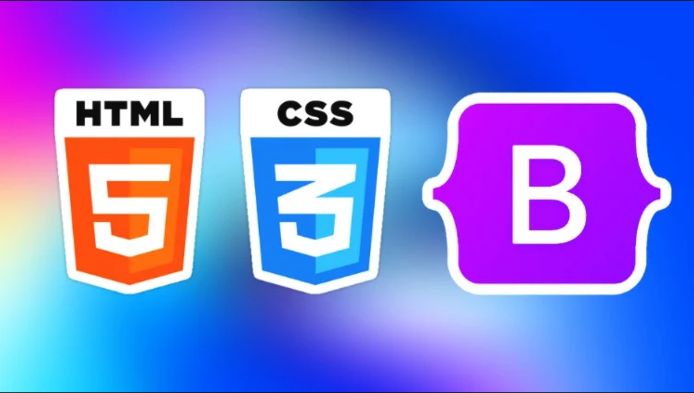

I have very limited experience with HTML and CSS, and I have absolutely no experience when it comes to using UI frameworks like Bootstrap 5. So, as one can imagine, my learning experience with HTML and Bootstrap 5 has been very difficult. However, both HTML and Bootstrap offer a very unique coding process. Working with both tools has given me a lot of insight into web page building.

# HTML and CSS

My experience programming in base HTML and CSS has been rather straightforward. Getting it set up in visual studio was rather simple, and most WOD's (class assignments) felt very manageable to complete. I also realized that I was slowly progressing my programming abilities with each assignment. One of my assignments was a 3-parter that involved coding a browser history website. My completion time of each part got quicker and quicker, 20 minutes for part 1, 14 minutes for part 2, and 13 minutes for part 3. With each assignment, I was getting quite comfortable in the language. 

# Bootstrap 5

Learning Bootstrap on the other hand was much weirder. Some of the documentation seemed simple at first, but I don't think I'm able to properly utilize it. For example, the Bootstrap containers seem useful. They are simple methods of sectioning a website. But, I've yet to find much utility for the container function. I've been able to format most of my websites by adjusting the margin, padding, width, height, and coordinates of different elements. I became familiar with these elements and the documentation for them, I'm not so familiar with the Bootstrap containers. Bootstrap also has a ton of classes and alts that can adjust how things are displayed. However, being so unfamiliar with the UI means that I find these things more distracting. I have trouble finding documentation for the adjustments I want and I find myself switching to css often. 

That isn't to say I find Bootstrap to be useless. Some of the options available are really helpful. Bootstrap has a wide variety of popular icons that can be easily programmed into a website. For example, the following code: <i class="bi bi-0-circle"></i> adds a circle icon into the website. This is really useful as I would otherwise try to implement these symbols by adding images which is really inconvenient. The navbar function is also extremely helpful. I have no idea how I'd make a navbar in raw HTML, but this UI tool simplifies things so much that it's painless to implement. The following is an example of the Bootstrap navbar code:

```cpp
    <!-- Navbar -->
        <nav class="navbar navbar-expand-sm navbar-dark bg-light py-3">
            
            <div class="container">
                <ul class="bar navbar-nav justify-content-center py-3" style="font-size: 15px; color: darkslategrey;">
                    <ul>Home</ul> 
                    <ul class="dropdown-toggle">About</ul> 
                    <ul class="dropdown-toggle">Services</ul> 
                    <ul>Testimonials</ul> 
                    <ul class="dropdown-toggle">Portfolio</ul> 
                    <ul>Blog</ul> 
                    <ul>Contact</ul> 
                    <ul class="nav-item"><i class="bi bi-moon-fill"></i></ul>
                </ul>
            </div>
        </nav>
```
The above code uses the <nav> statement to create a navbar. This simplifies things a lot since every other statement nested in the <nav> brackets are contained in the navbar and organized accordingly.

# Experiences and Challenges

# Final thoughts

I don't find much utility in using UI frameworks at the moment. I've yet to learn how to properly use all the main functions provided by HTML and CSS. This makes implimenting a different UI framework both difficult and confusing. 
