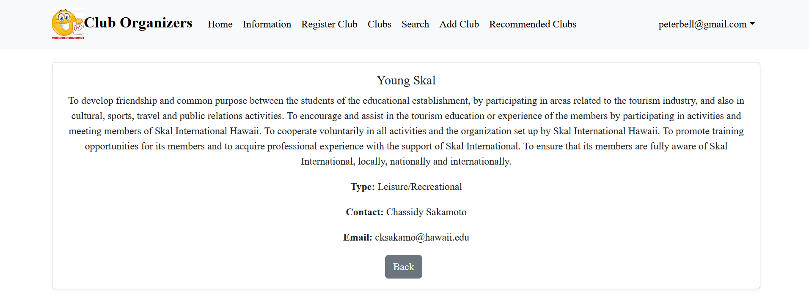
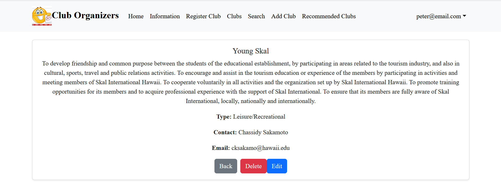

<div class="text-center p-4">
  
</div>

## Introduction
My final project for my Software Engineering I class was a group project that involved implementing a web page. This webpage would be capable of displaying all the organizations of UH Manoa, it would also be capable of adding and editing new and existing clubs. Up to this point, I've never implemented a webpage to this scale. Thus, it was a challenging experience for me. Here I'll cover the project step by step and everything I learned from it. 

## Setup
Before our group did any coding, we first had to set up some items to organize our project. We created a detailed page about our project that outlines our scope and plans for implementation. Our member Brandon did most of the work for this page providing a lot of detail for our approach as well as a mockup website. 
It was also important to set up a milestone page. This resource would act as a great way to organize our activity. The page would include a detailed list of all our required tasks, and we could categorize those tasks into as being incomplete, in progress, or finished. This way we would have a visual representation of our progress. 
With those items completed, our team shifted work to programming. In order to implement the webpage, we would work mostly in typescript while using Vercel as our deployment method. 

## Initial Phase
The first main phase of the project was getting the basics set up. This included a landing page, a club display page, an information page, a login page, a sign up page, and a search tab. These pages didn’t need to function at first, our focus was to get these pages to display. 
Most members got to work programming. Kenji wrote a lot of the initial code including a landing page which is shown in the image below. I would implement the information tab while Rei worked on running Vercel. After about a week, we successfully deployed our draft webpage to vercel. While our site didn’t have any functionality yet, having an outlined skeleton page would help us implement necessary functions later down the line. 

<div class="text-center p-4">
  
</div>

## Main Phase
After the team initialized the website, it was time to implement the full functionality of our vision. There were a few key aspects to the website. For one, we needed a data table with all the UH Manoa organizations listed. We would also need to add the capacity to edit, create, and delete clubs. We would also need to implement a login feature that could discern different login accounts to have either user, admin, or creator privileges. 
Jaaron did a lot of the login work. Over the course of a week, he was able to implement a login page that could both log users and register new ones. Later on, he would create a data table that stored all the login accounts. This would be very important as the table would discern the different roles of each account. 
While I didn’t do much work for the login, I was able to work on the club database. Rei set up a club data table in Vercel which stored all the important club data from UH. From this, I researched and implemented algorithms to read and edit the information from the data table. Below are a couple important examples of my code.  

Creating a client: 
- NEXT_PUBLIC_SUPABASE_URL = Vercel database url
- NEXT_PUBLIC_SUPABASE_ANON_KEY = key to the database 
```
import { createClient } from '@supabase/supabase-js';

const supabaseUrl = process.env.NEXT_PUBLIC_SUPABASE_URL;
const supabaseKey = process.env.NEXT_PUBLIC_SUPABASE_ANON_KEY;

const supabase = createClient(supabaseUrl, supabaseKey);

export default supabase;
```

Reading the database using the client:
- Algorithm checks a user and reads the “role” and “club” sections from the same row
- The “role” and “club” data are stored in the “data” variable
- Logs errors if for whatever reason the data couldn’t be read
```
const [currentUserRole, setCurrentUserRole] = useState<string | null>(null);
const [currentUserClub, setCurrentUserClub] = useState<string | null>(null);

const { data: session } = useSession();
const currentUser = session?.user?.email;

useEffect(() => {
  const fetchUserDetails = async () => {
    if (!currentUser) return;

    try {
      const { data, error } = await supabase
        .from("User")
        .select("role, club") // Fetch both role and club
        .eq("email", currentUser)
        .single(); // Fetch a single row

      if (error) {
        console.error("Error fetching user details:", error);
      } else if (data) {
        setCurrentUserRole(data.role); // Set the role from the database
        setCurrentUserClub(data.club); // Set the club from the database
      }
    } catch (err) {
      console.error("Unexpected error fetching user details:", err);
    }
  };

  fetchUserDetails();
}, [currentUser]);
```

The above pieces of code were some of the most important to get the algorithm operating. The first piece is what allows the algorithms to read from the data table. The second piece of code is in almost every page of the site as it reads the user and club data. 
The first thing I implemented was the ability to read and display each individual piece of club data. Kenji would later improve on this feature by giving each club its own individual subpage. However, it was one thing to read from the database, but it was another thing to edit it. 
It would take a while, but with a little over a week's worth of effort. We were able to create an add and edit feature that would update the clubs data table. This would in real time affect the website as users could create new clubs and view them on the clubs page. 

## Final Phase 
For the last phase of the project, my focus was on implementing user privileges to certain pages. Our team didn’t want normal users to freely add and edit the club data. We also didn’t want club owners to be able to edit other users' clubs. So, I made multiple changes to the clubs edit, add, and delete features to prevent this from happening. 
Normal users were barred from seeing the “add” page in the navbar. But, even if they manually typed in the url for the add page, they still wouldn’t be capable of adding a club. This is because there’s a user check when creating a club. If the user isn’t an owner or an admin, the check fails and the club isn’t created. The check also fails if the user is an owner with a club. We didn’t want owners to freely add a bunch or organizations to the site. Thus, I made it so that owner roles are limited to creating one club. 

Code checks user role:
- Simple if statement checks for admins and owners
- Updates the data table through the .update command
- Also updates the currentUserClub variable to the added club. This prevents owners from making multiple clubs
```
// If the user is an OWNER, update their "club" column in the User table
if ((currentUserRole === "OWNER" && currentUserClub === null) || currentUserRole === "ADMIN") {
  try {
    const { error: updateError } = await supabase
      .from("User")
      .update({ club: formData.name }) // Update the "club" column with the new club name
      .eq("email", currentUser); // Match the current user's email

    if (updateError) {
      console.error("Error updating club for OWNER:", updateError);
    } else {
      console.log("Club updated successfully for OWNER:", formData.name);
      setCurrentUserClub(formData.name); // Update the local state
    }
  } catch (err) {
    console.error("Unexpected error updating club for OWNER:", err);
  }
} else {
  setFormError("Account doesn't have club registration permission.");
  setIsSubmitting(false); // Reset the submitting state
  return; // Exit the function early to prevent further execution
}
```

The edit clubs page also similarly has restrictions. An admin will have the option to freely edit any page, however, a user will be completely barred from this. They will again not have access to the edit button, and even if they somehow manually type the url, a check is in place that prevents users from submitting their edits. For owners this is a little bit different, they are only capable of editing a club they created. Otherwise, they are similarly barred from editing. The deletion process has the same restrictions. 

Example of the differences in page layout depending on user:
<div class="text-center p-4">
  
</div>

<div class="text-center p-4">
  
</div>


## Links:

Project Page: <a href="https://club-organizers.github.io/"><i class="large github icon "></i>Club Organizers Project</a>

GitHub: <a href="https://github.com/club-organizers"><i class="large github icon "></i>Club Organizers GitHub</a>

Source: <a href="https://club-main-sandy.vercel.app/LandPage"><i class="large github icon "></i>Vercel Deployement</a>
