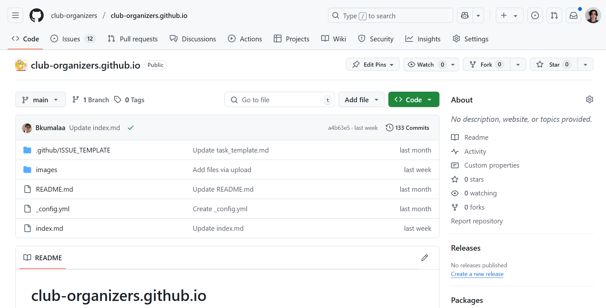
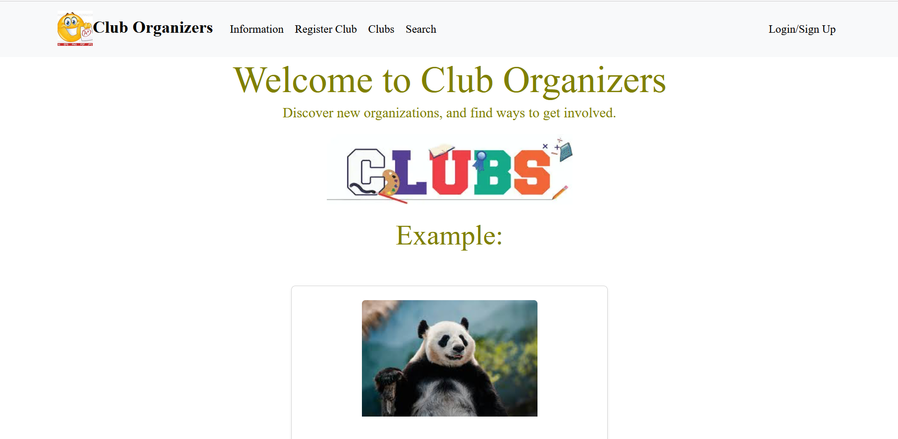

  

## Introduction
My final project for my Software Engineering I class was a group project that involved implementing a web page. This webpage would be capable of displaying all the organizations of UH Manoa, it would also be capable of adding and editing new and existing clubs. Up to this point, I've never implemented a webpage to this scale. Thus, it was a challenging experience for me. Here I'll cover the project step by step and everything I learned from it. 

## Setup
Before our group did any coding, we first had to set up some items to organize our project. We created a detailed page about our project that outlines our scope and plans for implementation. Our member Brandon did most of the work for this page providing a lot of detail for our approach as well as a mockup website. 
It was also important to set up a milestone page. This resource would act as a great way to organize our activity. The page would include a detailed list of all our required tasks, and we could categorize those tasks into as being incomplete, in progress, or finished. This way we would have a visual representation of our progress. 
With those items completed, our team shifted work to programming. In order to implement the webpage, we would work mostly in typescript while using Vercel as our deployment method. 

## Initial Phase
The first main phase of the project was getting the basics set up. This included a landing page, a club display page, an information page, a login page, a sign up page, and a search tab. These pages didn’t need to function at first, our focus was to get these pages to display. 
Most members got to work programming. Kenji wrote a lot of the initial code, he first created a landing page which is shown in the image below. I would implement the information tab while Rei worked on running Vercel. After about a week, we successfully deployed our draft webpage to vercel. While our site didn’t have any functionality yet, having an outlined skeleton page would help us implement necessary functions later down the line. 

  

Source: <a href="https://gamejolt.com/games/Lycoris/903344"><i class="large github icon "></i>GameJolt.com/games/Lycoris.</a>
