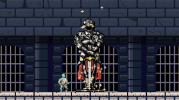

  

  Lycoris is a lengthy metroidvania platformer game that I developed with my friend Joana back in high school. This game project took many months to build and has helped me develop as a programer. 
  
  The game starts with the player character shackled and confined in a small room. Exploring the world from this point only leads to dangerous monsters and powerful bosses. However, it's not hopeless for the player. The player is capable of replenishing health by defeating enemies. There's also many large statues that can heal the player and unlock stat bonuses. As the game progresses, the player will gain more abilities turning this daunting world into one they can conquer.

Source: <a href="https://gamejolt.com/games/Lycoris/903344"><i class="large github icon "></i>GameJolt.com/games/Lycoris.</a>
