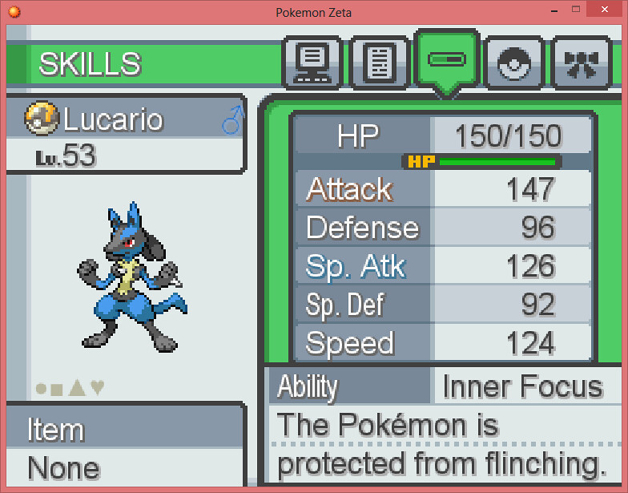

<div class="text-center p-4">
  
</div>

This java project is fully written by myself and it involved developing a Pokemon object that stores the stats and names of different Pokemon. The system would be capable of printing the following information about each pokemon:

```cpp
Species: <Pokemon species>
Name: <Pokemon name>
Number: <number>
Type: <type1> | <type2>
HP: <hitPnts>
CP: <comPwr>
```

This program is also capable of setting the stats of each Pokemon or gaining a singular stat of each Pokemon. It's even capable of calculating the stats of a Pokemon when they power up much like the games themselves. 

Although I was inexperience with Java at the time, I was able to quickly learn the language and score perfectly on this assignment. This project taught me many fundamental elements of Java programing as well as how to work in a Repository. Learning these skills by participating in a fun project kept me motivated to learn more about the field of programming. 

The following is a quick snippit of code:
```
  /**
    * Creates a Pokémon object. Uses the species name as the nickname.
    * @param newSpecies The species. Also used as the nickname.
    * @param newNumber The Pokédex number.
    * @param newType1 The first type.
    * @param newType2 The second type.
    */
  Pokemon(String newSpecies, int newNumber, String newType1, String newType2) {
      setSpecies(newSpecies);
      setName(newSpecies);
      setNumber(newNumber);
      setType1(newType1);
      setType2(newType2);
      int newHitPnts = generateHitPnts();
      setHitPnts(newHitPnts);
      setComPwr((int) (newHitPnts * generateMultiplier()));
   }

  /**
    * Boosts the Pokémon's HP and combat power.
    */
  public void powerUp() {
      setHitPnts((int) (this.hitPnts + 1.15d + (0.2d * this.hitPnts)));
      int newComPwr = (int) (this.hitPnts * generateMultiplier());
      if (newComPwr > this.comPwr) {
         setComPwr(newComPwr);
      }

   }
```
The above code simply displays the sections where a Pokemon object is created and the calculations used to power up a pokemon. 

The gitHub source is private so unfortunately I can't provide a source link.
