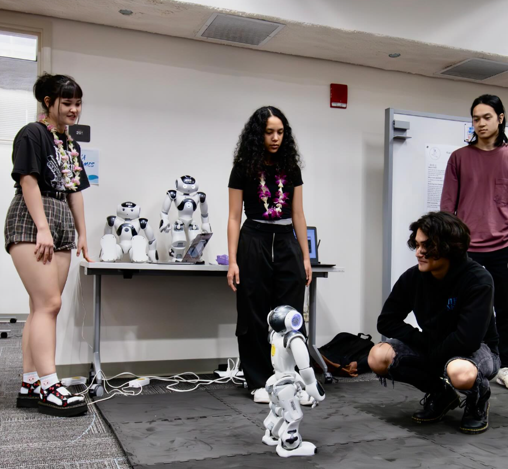

In Spring 2023, I participated in the robotics program at Kapi'olani Community College. This project had us research and program Nao Robots to do certain tasks. In the end, we would present our project at the KCC SURF fair for Spring 2023. 

While we had hoped to create a complex and interesting program that the Nao Robots could perform, the real difficulty of the project was simply finding and creating documentation to program the robots. The language the robotics team previously used was called Choreographe, and this language has very little documentation and support. In fact, the company behind the robots seemed to be in financial struggle and in the middle of a merger to another company. This meant that support and updates to the robots were non-existant. Because Choreographe was a limiting coding base, the project ultimately shifted towards getting Ros (a robot programming language with more support and documentation) installed on the Nao robots and programming from there. 

This was a very time consuming and difficult task. Since the documentation was so low, we had to tackle the issue through trial and error without a hard grasp on the code. Some routes looked promising, but a lot of them turned into dead ends. 

However, towards the later end of the project, we were able to get the language operating on the robots. I was able to work in the Ros language and code basic functions like having the robot move in a circle. Because we were short on time, we weren't able to create a large scale program for the robots. However, we were able to create important and vital documentation that anyone in the future could use to help them work with Nao Robots. 

In the end, the process of research and failure helped me learn many things about the programming process. I learned about the importance of documenting code and what to do when resources are low. 

Source: <a href="https://github.com/Peter-Bel/KCC-Robot-Projects">ICSatKCC/KCC-Robot-Projects</a>
